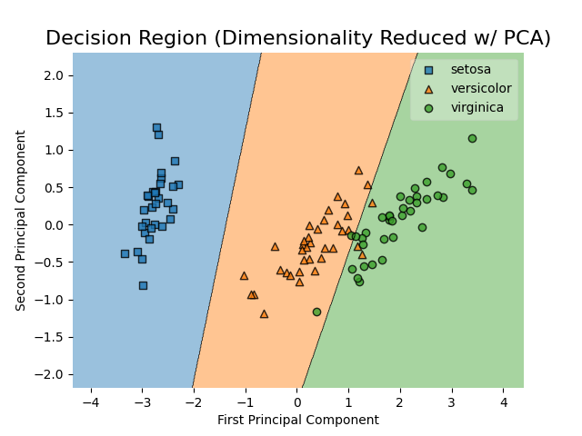
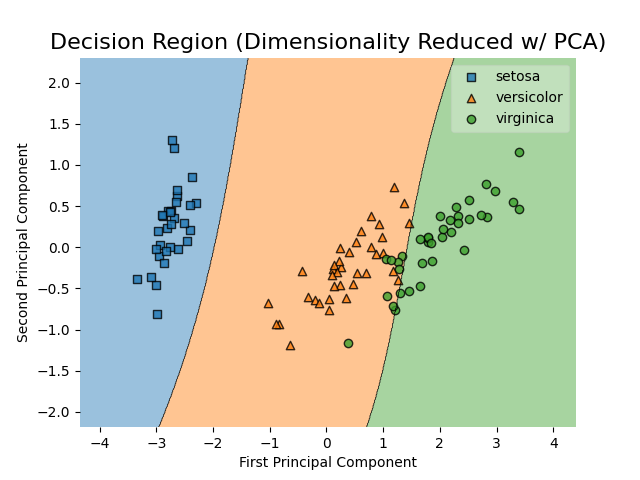
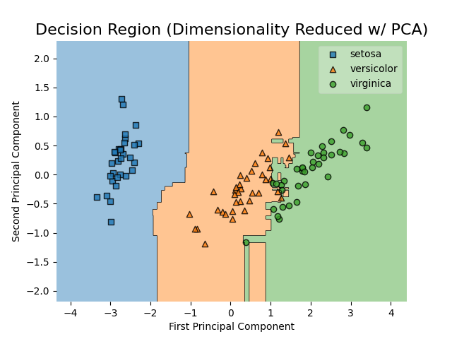

# Machine Learning Algorithm Tester

This project mainly aims to visualize decision regions of various machine learning algorithms in scikit-learn. Currently, it implements LogisticRegression(), SVC(), and RandomForestClassifier(). It runs against the iris dataset and its 4 features, so the graphs use PCA dimensionality reduction to easily visualize results.

## Features

### Hyperparameter Tuning

Under src/Preprocessing, hyperparam_finder.py is designed to find the optimal parameters from a given parameter grid for the models listed in algorithms/model_defns.yml. This makes use of GridSearchCV to exhaustively search them, and simply scores against accuracy. The final parameters are output into algorithms/model_params.yml.

### Dynamically Add New Models

Data for models is housed in model_defns.yml. To add new models to test with, simple match the existing format: function reference as they key, holding param_grid as a list. These functions will need to be imported into the scripts however. Both core scripts for preprocessing and testing will run against all models listed, so no code modifications need to be made to get your test results and decision region graph

## Output

From the aforementioned algorithms implemented, we find the below decision region graphs. Note, these algorithms are run against the iris dataset and its 4 features. So, these plots use dimensionality reduction with PCA to achieve results that can be easily visualized.

### Decision Graphs

**Logistic Regresion**

**Support Vector Classifier**

**Random Forest Classifier**

